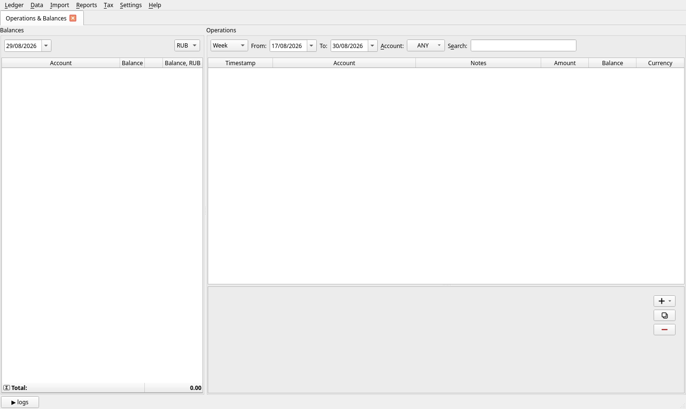
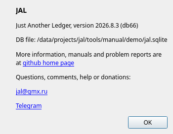

[← What JAL is](01-what-is-jal.md) | [Contents](README.md) | [Next: Your first half hour →](03-first-steps.md)

# 2. Installing and starting JAL

JAL runs on Windows, macOS and Linux. It is a Python program, so Python has to be on your computer
first — that is the only preparation.

## Step 1 — Python

You need **Python 3.9 or newer**.

* **Windows**: download the installer from [python.org](https://www.python.org/) and run it. On the
  first page of the installer tick **“Add Python to PATH”**, and leave the *pip* option switched on.
  Restart the computer afterwards so the change takes effect.
* **macOS**: `brew install python3`, or the installer from python.org.
* **Linux**: Python is almost certainly installed already. If not, install the `python3` and
  `python3-pip` packages of your distribution.

To check, open a terminal (*Command Prompt* or *PowerShell* on Windows) and type:

```
python --version
```

If it answers with a version of 3.9 or higher, you are ready. (On some systems the command is
`python3` instead of `python`; use whichever answers.)

## Step 2 — JAL

In the same terminal:

```
pip install jal
```

That downloads JAL and everything it needs. It takes a minute or two.

> **This is a terminal command, not something to type inside Python.** If you see a prompt of three
> angle brackets `>>>`, you are inside the Python shell — type `exit()` first.

## Step 3 — start it

```
jal
```

The main window opens. If your system cannot find the `jal` command, use the longer form, which
always works:

```
python -m jal.jal
```

You may want a desktop shortcut to that command — JAL does not create one for you.

### Starting from the source code instead

If you would rather run the development version:

```
git clone https://github.com/titov-vv/jal.git
cd jal
pip install -r requirements.txt
python run.py
```

## What happens the first time

JAL creates its database automatically and opens an empty window: no accounts, no operations, and a
reporting currency of **RUB**, which is only a placeholder until you say where you live.



Do not worry about the emptiness — [the next chapter](03-first-steps.md) fills it in.

## Where your data is kept

Everything is in one file named `jal.sqlite`, which lives next to the program by default.
**To see its exact location, open *Help → About JAL*:**



Write that path down. It is the file you back up, and the file you copy when you move to a new
computer.

### Putting the file somewhere else

Keeping the ledger in your own documents folder (or in a folder that a cloud service syncs) is often
more convenient. To do that, create a small text file called `jal.ini` in your operating system's
configuration folder — `%APPDATA%` on Windows, `~/.config` on most Linux systems, `~/Library/Preferences`
on macOS — containing:

```ini
[main]
database_path=/home/anna/Documents/jal
```

Use the folder, not the file name: JAL will look for `jal.sqlite` inside it. Move your existing
`jal.sqlite` there before restarting, or JAL will create a new, empty one.

> **One writer at a time.** Do not let two computers write to the same synced file at once, and let
> the sync finish before opening JAL on the other machine.

## Upgrading

```
pip install jal -U
```

Your data file is not touched by an upgrade. If the new version needs a newer internal format, JAL
converts your database when it next starts and tells you so. It may then offer to rebuild its
ledger — say yes.

> **Back up before a big upgrade.** *Ledger → Backup…* takes ten seconds; see
> [chapter 12](12-settings-and-maintenance.md).

## Removing JAL

```
pip uninstall jal
```

This removes the program. Your `jal.sqlite` may survive in the folder it lives in — delete it by hand
if you really want the data gone, and keep a backup if you might not.

---

[← What JAL is](01-what-is-jal.md) | [Contents](README.md) | [Next: Your first half hour →](03-first-steps.md)
