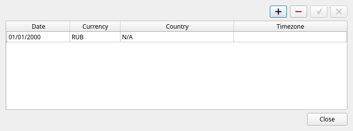
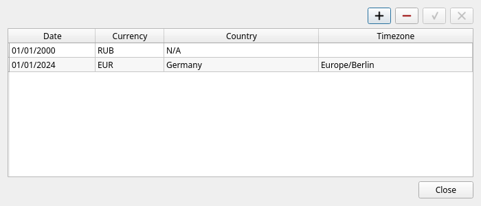
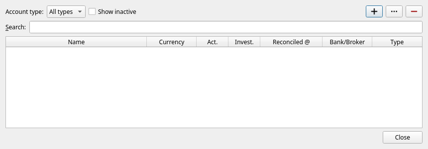
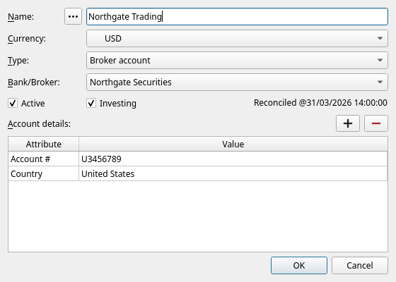
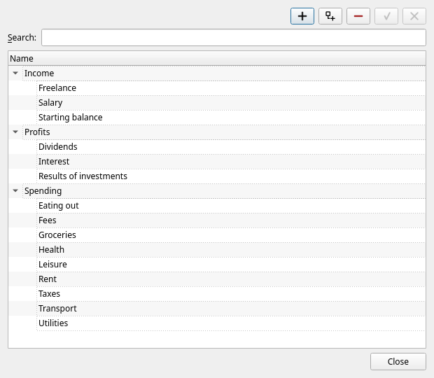
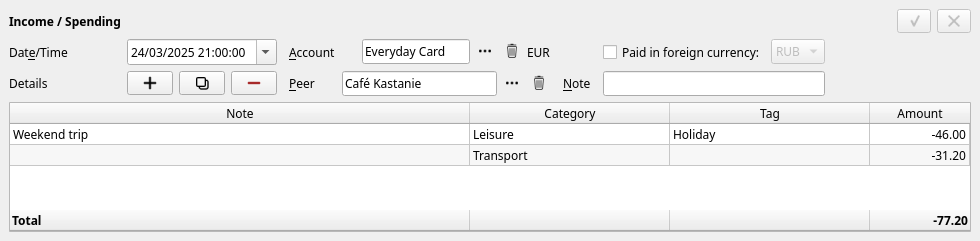

[← Installing](02-install.md) | [Contents](README.md) | [Next: The main window →](04-main-window.md)

# 3. Your first half hour

This chapter takes you from an empty JAL to a window that shows your real balances. Do the four
steps in order; each takes a few minutes.

## Step 1 — Tell JAL where you live

JAL needs to know one thing before anything else: **which currency your totals should be shown in**.
It takes that from your *residence* — the country you live in, the currency you report in, and the
clock your dates are read on.

Open **Data → Residence**. A new database already has one row in it, dated 1 January 2000, with the
currency set to RUB:

Change that row to describe you:

1. Double-click the **Currency** cell and pick your own currency from the list.
2. Double-click **Country** and pick your country.
3. Double-click **Timezone** and pick the zone you live in (for example `Europe/Berlin`).
4. Click the **✓** button at the top right to save, then **Close**.

> **Only three currencies are offered at first** — EUR, USD and RUB, the ones JAL is shipped with.
> If yours is not there, see *Adding a currency* in [chapter 6](06-investments.md#adding-a-currency).

> **Moved country?** Do not overwrite the old row — add a second one (the **+** button) dated from
> the day you moved. JAL keeps a timeline, so each operation is reported under the rules that applied
> when it happened. Most people only ever need one row.

## Step 2 — Create your accounts

Open **Data → Accounts**. The list is empty:

Click **+**. A form opens:

Fill it in:

| Field | What to put there |
|---|---|
| **Name** | Whatever you will recognise: *Everyday Card*, *Main Bank*, *Cash in wallet*. |
| **Currency** | The one currency this account holds. |
| **Type** | *Cash*, *Bank account*, *Card*, *Broker account*, *Wallet* (crypto) or *Crypto exchange*. Used for grouping and for offering you the right things later. |
| **Bank/Broker** | The institution. Leave it as *None* for cash. You can type a new name into the box. |
| **Active** | Leave ticked. Untick it when an account is closed, to hide it without deleting its history. |
| **Investing** | Tick it **only** for accounts that can hold shares, funds, bonds or crypto. |
| **Account details** | Extra facts, added with the **+** button next to the table: *Account #*, *Credit* (a card's credit limit), *Country*, *Precision* (how many decimals the account counts in — 2 for money). |

Click **OK**. Repeat for every account you have, then **Close**.

> **One currency per account.** A bank account you hold in two currencies is two accounts in JAL.
> Give the second one the same account number and JAL will offer to copy the first one's settings.

### How much is in them right now?

JAL computes balances from operations, so a brand-new account starts at zero. Tell it where you are
starting from by recording one operation per account:

1. In the main window pick the account (the **Account:** box above the operations list).
2. Press the **+** button at the right and choose **Income / Spending**.
3. Set the date to the day you are starting from.
4. In the table at the bottom press **+** to add a line, set its **Category** to *Starting balance*
   and its **Amount** to what the account holds (a negative amount for a card you owe money on).
5. Press **✓** to save.

## Step 3 — Set up your categories

Categories are what makes the spending reports useful. JAL comes with a small set — *Income*,
*Spending*, *Profits* and a few required ones — and you add your own underneath them.

Open **Data → Categories**:

* **+** adds a category next to the one selected; the button beside it adds one *inside* it.
* Type the name, press the **✓** button to save.

Ten or fifteen categories are plenty: *Groceries*, *Rent*, *Utilities*, *Transport*, *Eating out*,
*Health*, *Leisure*, *Salary*. You can add more at any time.

> Nine categories are built in — *Income*, *Spending*, *Profits*, *Starting balance*, *Fees*,
> *Taxes*, *Dividends*, *Interest* and *Results of investments*. JAL writes into them itself when it
> books a fee or a dividend, so they cannot be deleted. You may rename them, and you may put your own
> categories underneath them.

## Step 4 — Record something

Pick an account, press **+**, choose **Income / Spending** and fill in the editor at the bottom of
the window:

* **Date/Time** — when it happened.
* **Peer** — the shop, employer or person on the other side. Type a new name and JAL offers to
  create it.
* The table — one line per thing you are recording. Each line has a **Category**, an optional
  **Tag**, an optional **Note** and an **Amount**. **Money going out is negative**; money coming in
  is positive. A supermarket bill split into *Groceries* and *Household* is two lines on one
  operation.
* **✓** saves, **✗** throws the changes away.

The operation appears in the list above and every balance updates immediately.

## What next

You now have a working ledger. From here:

* [Chapter 4](04-main-window.md) explains every part of the window you are looking at.
* [Chapter 5](05-everyday-money.md) covers day-to-day recording: transfers, tags, reconciling.
* If you have a brokerage account, go on to [chapter 6](06-investments.md).
* Before you have much to lose, read the two paragraphs on backups in
  [chapter 12](12-settings-and-maintenance.md).

---

[← Installing](02-install.md) | [Contents](README.md) | [Next: The main window →](04-main-window.md)
