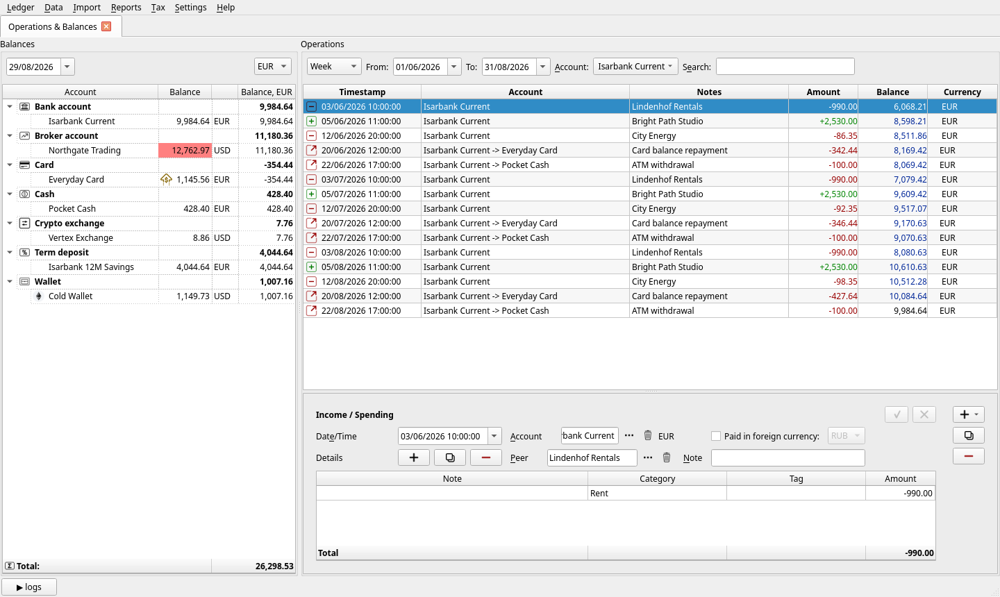
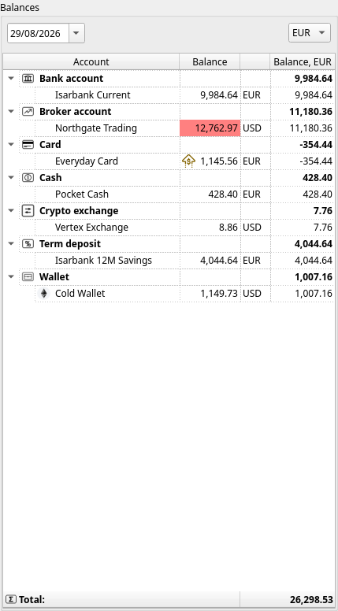
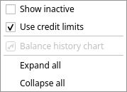
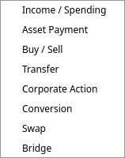
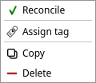
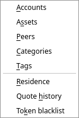

[← Your first half hour](03-first-steps.md) | [Contents](README.md) | [Next: Money in and money out →](05-everyday-money.md)

# 4. The main window

Almost everything you do in JAL happens in one window. This chapter names every part of it.

The window has four areas:

* the **menu bar** along the top;
* **Balances** on the left — what you have;
* **Operations** on the right — what happened;
* the **editor** underneath the operations — the details of whatever is selected.

At the very bottom is a **logs** button that opens JAL's message panel.

## Tabs

JAL opens its windows as **tabs** across the top. *Operations & Balances* is the one you start in;
every report you open adds another. Close a tab with the **✗** on it — closing the operations tab is
harmless, **Ledger → Operations** brings it back. Some small windows (charts, tax forms) open as
windows of their own instead of as tabs.

## The Balances panel

A list of your accounts, grouped by type, showing what each one holds.

* The **date box** at the top left is the day the balances are shown *as of*. Set it to any past
  date to see what you had then.
* The **currency box** at the top right chooses the currency the last column (*Balance, …*) is
  converted into. It starts at your reporting currency.
* **Balance** is the amount in the account's own currency; the last column is that amount converted.
  The **Total** at the bottom adds up the converted column.

Double-click an account and the operations list to the right jumps to it.

### The colours

The **Balance** cell is coloured when the account has not been checked against reality for a while:

| Colour | Meaning |
|---|---|
| no colour | reconciled recently — JAL's figure was confirmed against a statement |
| yellow | more than a week of operations since the last check |
| red | more than a fortnight |

This is a reminder, not an error: it says *"nobody has confirmed these numbers lately"*. See
[*Reconciling*](05-everyday-money.md#reconciling-checking-jal-against-reality) in the next chapter.
In the picture above, the trading account is red because it was last checked in March.

A small **coin icon** beside a balance means the figure includes a credit limit — the card above
holds −354.44 of its own but has 1,500 of credit, so 1,145.56 is what could still be spent.

### Right-click on the panel

* **Show inactive** — also list accounts you have switched off.
* **Use credit limits** — whether card limits are added to balances, as described above.
* **Balance history chart** — opens the [account balance history](10-reports.md#account-balance-history)
  report for the account under the cursor.
* **Expand all / Collapse all** — the account-type groups.

## The Operations list

Every operation, oldest first, one per line — with a running **Balance** column so you can follow the
account from line to line. The icon at the left says what kind of operation it is.

Three controls above the list decide what is shown:

* **Period** — a preset (*Week*, *Month*, *Quarter*, *Year*, *All dates*) plus a **From** and **To**
  date you can set by hand. The presets count backwards from today; the dates are yours to override.
* **Account** — one account, or *ANY* for all of them at once.
* **Search** — free text; only the operations whose text matches stay on screen.

### The buttons on the right

| Button | Does | Shortcut |
|---|---|---|
| **+** | New operation. The small arrow opens the list of kinds. | `Ctrl+N` |
| **copy** | A new operation pre-filled from the selected one — the fastest way to record a repeating payment. | `Ctrl+D` |
| **−** | Delete the selected operation, after a confirmation. | `Del` |

### Right-click on an operation

* **Reconcile** — mark the account as checked up to this operation (see next chapter).
* **Assign tag** — put a tag on every line of the operation at once.
* **Copy**, **Delete** — the same as the buttons.

Two more entries appear only where they mean something: **Match cross-chain legs…** for a crypto
transfer whose other half is missing, and the settlement actions for a transfer that knows only one
of its two ends. Both are explained in [chapter 8](08-crypto.md).

## The editor

Select an operation and its details appear below the list. Each kind of operation has its own
editor; they all work the same way:

* Change whatever you like — the **✓** and **✗** buttons at the top right wake up as soon as
  something is different.
* **✓** (`Ctrl+S`) saves. **✗** (`Esc`) puts everything back as it was.
* A field JAL cannot do without is painted **red** until you fill it in.
* If you move to another operation with unsaved changes, JAL asks whether to save, discard or stay.

Every editor is described in [chapter 5](05-everyday-money.md) and [chapter 6](06-investments.md).

## The menu bar

| Menu | What is in it |
|---|---|
| **Ledger** | Backup, restore, re-build the ledger, delete everything, exit ([chapter 12](12-settings-and-maintenance.md)) |
| **Data** | The lists JAL keeps: accounts, assets, peers, categories, tags, residence, quote history, token blacklist ([chapter 5](05-everyday-money.md), [chapter 6](06-investments.md)) |
| **Import** | Broker statements, blockchain wallets, shop receipts, prices ([chapter 9](09-importing.md)) |
| **Reports** | Everything JAL can show you ([chapter 10](10-reports.md)) |
| **Tax** | Tax reports for Portugal and Russia ([chapter 11](11-taxes.md)) |
| **Settings** | Preferences and the interface language ([chapter 12](12-settings-and-maintenance.md)) |
| **Help** | This documentation, the FAQ, the list of messages, bug reports, and the *About* window with your database path |

## The log panel

The **logs** button in the bottom left corner opens a panel where JAL writes what it is doing:
prices downloaded, statements imported, and any complaint it has. When something has not worked as
you expected, that panel is the first place to look —
[chapter 13](13-troubleshooting.md) explains what the messages mean.

The latest message is also shown on the status bar beside the **logs** button, coloured by how
serious it is — grey for ordinary progress, orange for a warning, red for an error. It stays there
until you open the panel, so the panel itself can stay closed most of the time.

---

[← Your first half hour](03-first-steps.md) | [Contents](README.md) | [Next: Money in and money out →](05-everyday-money.md)
