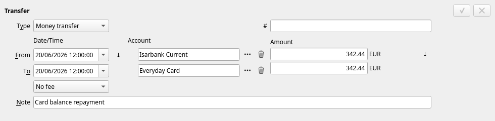
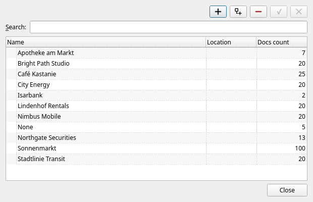
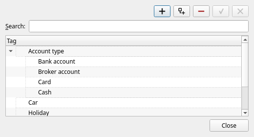
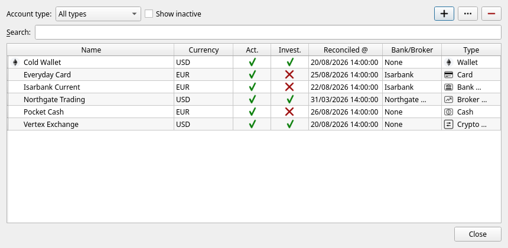

[← The main window](04-main-window.md) | [Contents](README.md) | [Next: Investments →](06-investments.md)

# 5. Money in and money out

This chapter covers everything you do with ordinary money: recording what you spend and earn, moving
money between your own accounts, labelling it all, and checking now and then that JAL agrees with
your bank.

## Income and spending

An **Income / Spending** operation records money crossing the boundary between you and the rest of
the world: a shop, an employer, a landlord, a tax office.

| Field | Meaning |
|---|---|
| **Date/Time** | When it happened. The time of day rarely matters, but the date does. |
| **Account** | Which of your accounts the money left or entered. |
| **Peer** | Who was on the other side. |
| **Note** (top) | A remark about the whole operation. |
| The table | One line per thing being paid for. |

Each line of the table has:

* a **Note** — what the line was for, in your own words;
* a **Category** — the label the spending reports add up by;
* a **Tag** — optional, see [below](#tags);
* an **Amount** — **negative for money going out**, positive for money coming in.

The **+**, **copy** and **−** buttons above the table add, duplicate and remove lines; **Total** at
the bottom is what the operation does to the account.

### Splitting one payment across categories

That is what the lines are for. One supermarket receipt can be *Groceries* −54.20 and *Household*
−12.90; a weekend away can be *Leisure* and *Transport*, as in the picture above. The reports then
count each part where it belongs, while the operation stays one payment of one total.

### Paying in another currency

Tick **Paid in foreign currency** and choose a currency. Each line then gets a second amount, in that
currency, next to the first. Use it when your account is charged in one currency but the bill was
written in another — a euro card used abroad, for instance. The account is still moved by the amount
in *its* currency; the second figure is kept as a record of what the bill actually said.

## Transfers

A **Transfer** moves money between two accounts that are both yours. It is *not* spending, and it
must never be recorded as two Income / Spending operations — the reports would then show money you
never earned and never spent.

* **Type** — *Money transfer* for cash, *Asset transfer* when shares or coins move between your
  accounts (see [chapter 6](06-investments.md)).
* **From** — date, account, amount leaving.
* **To** — date, account, amount arriving. The two dates can differ: a bank transfer that leaves on
  Friday and arrives on Monday is recorded exactly like that. The small **↓** buttons copy the date
  and the amount from the upper line to the lower one.
* **Fee** — the box below the dates chooses *No fee*, a fee in money, or gas (for blockchains).
  A fee is charged to the account you name, and lands in the built-in *Fees* category.
* **#** and **Note** — a reference number and a remark.

### Changing currency

If the two accounts hold different currencies, simply put the amount that left in **From** and the
amount that arrived in **To**:

> 5,000.00 EUR left the bank account, 5,219.21 USD arrived at the broker.

JAL needs no exchange rate for this — the transfer states it. This is how you record a currency
exchange, a card payment abroad from a euro account, or funding a foreign brokerage account.

### Transfers with one end missing

Sometimes only one side is known — money has left, and where it went will be recorded later (this
happens most with crypto and with imported statements). JAL accepts such a half-transfer and shows
its other end as *(pending)*. The [Unsettled transfers](10-reports.md#unsettled-transfers) report
lists them all, and the right-click menu on the operation offers to complete it.

## Peers — who you dealt with

A **peer** is the other party: a shop, an employer, a bank, a friend. Manage the list in
**Data → Peers**:

Peers can be nested — you might keep every supermarket under one parent — and the
[operations by peer](10-reports.md#operations-by-category-peer-or-tag) report totals everything you
have ever paid to one of them.

You do not have to fill the peer in. Leave it empty when it does not help you.

## Tags

A **tag** is a free label that crosses categories. `Holiday`, `Car`, `Renovation`, `Refundable`.
Manage them in **Data → Tags**:

Tags are set **per line** of an operation — the *Tag* column in the editor's table. To tag every line
of an operation at once, right-click it in the list and choose **Assign tag**.

The [operations by tag](10-reports.md#operations-by-category-peer-or-tag) report then adds up
everything carrying the tag, whatever category it was under. Tags can also be attached to assets,
which lets the portfolio be grouped by them — see [chapter 6](06-investments.md).

## Repeating operations

Most household spending repeats. Select last month's operation, press **copy** (or `Ctrl+D`), and a
new operation appears with everything already filled in — change the date and the amount and save.

## Correcting and deleting

Select the operation, change what is wrong in the editor, press **✓**. To remove it, select it and
press **−** (or `Del`) and confirm. There is no undo, so if the operation was hard to reconstruct,
make a backup first.

Balances and reports catch up immediately: JAL rebuilds the affected part of its ledger every time
you save or delete.

## Reconciling: checking JAL against reality

Reconciling means: *"I have compared JAL with my bank statement up to this date, and they agree."*

To do it: find the last operation you have checked, right-click it, and choose **Reconcile**. The
account is marked as confirmed up to that operation's date, and the colour disappears from the
balances panel until new operations pile up again.

Nothing else is changed — reconciling is a note to yourself. Its value is that the colour tells you,
at a glance, which accounts you have not checked recently, and the account editor shows the date of
the last check.

> When you import a broker statement, JAL compares the statement's closing balance to its own
> figure, and reconciles the account automatically when the two agree. If they disagree, it says so
> in the log and leaves the account unreconciled. See [chapter 9](09-importing.md).

## Accounts you no longer use

Do not delete a closed account — its history is part of your past. Open **Data → Accounts**:

select the account, press **…** to open it, and untick **Active**. It disappears from the balances panel and from the pickers, while every
operation it holds stays in the reports. Tick **Show inactive** to see such accounts again.

---

[← The main window](04-main-window.md) | [Contents](README.md) | [Next: Investments →](06-investments.md)
