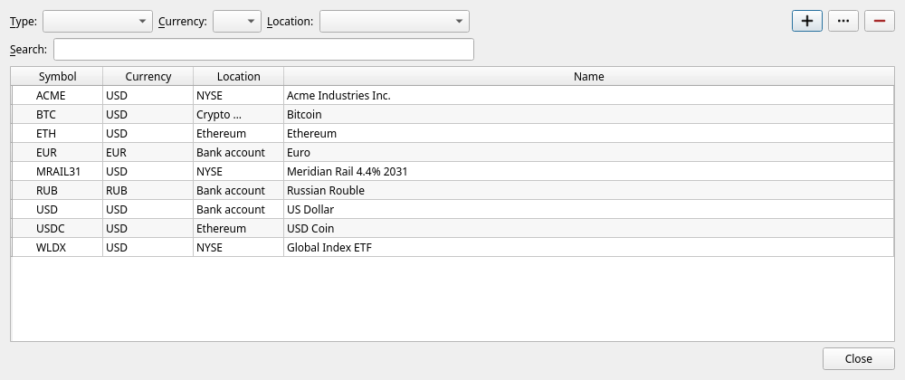
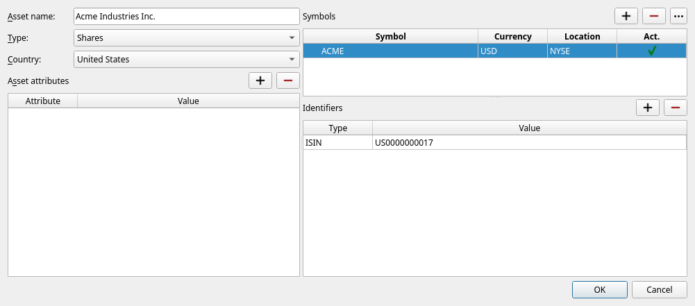
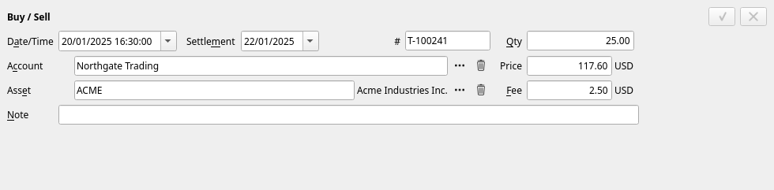
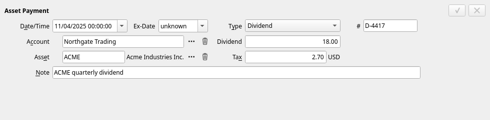
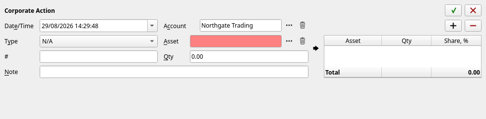
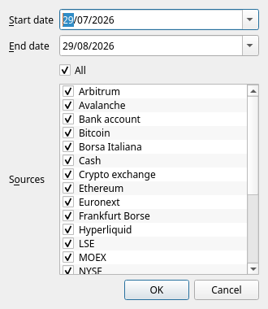
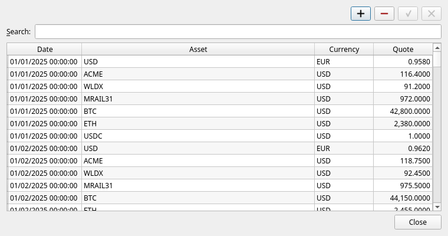
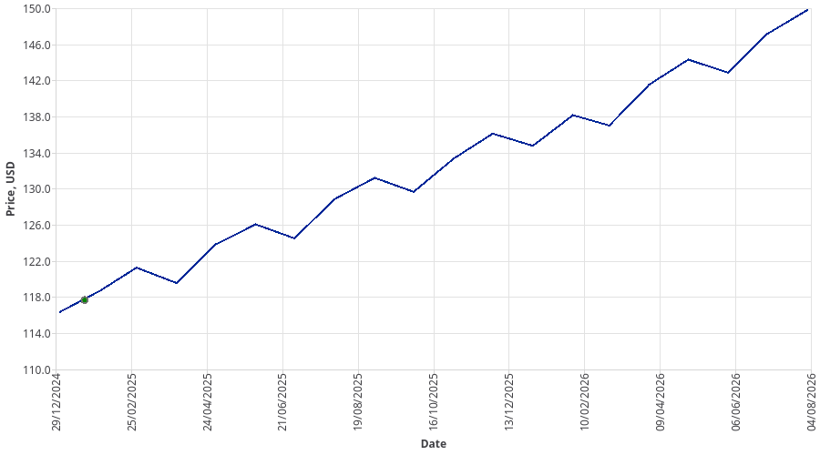
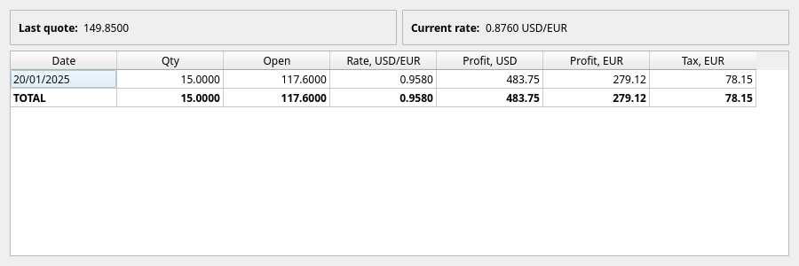

[← Money in and money out](05-everyday-money.md) | [Contents](README.md) | [Next: Term deposits →](07-deposits.md)

# 6. Investments

If you own shares, funds, bonds or crypto, JAL can tell you what they are worth, what they cost you,
what they have paid out and how much of the difference is profit. This chapter covers the ordinary
investment life-cycle. Crypto has extras of its own, in [chapter 8](08-crypto.md).

## Setting up an investment account

Create the account as in [chapter 3](03-first-steps.md), with two particulars:

* **Type** = *Broker account* (or *Crypto exchange* for a crypto venue);
* **Investing** ticked — this is what allows the account to hold assets and not only money.

Under **Account details** it is worth adding:

* **Account #** — your account number at the broker. Statement imports match on it.
* **Country** — where the broker is. Tax reports use it.
* **Precision** — how many decimals the account counts money in (2 for a normal broker; more for
  crypto venues).

Then fund it. Money reaching a broker comes from another account of yours, so it is a **Transfer** —
and if the currencies differ, the transfer itself states the exchange (see
[chapter 5](05-everyday-money.md#changing-currency)).

## Assets and their listings

An **asset** is the thing itself — *Acme Industries Inc.* A **listing** (JAL calls it a *symbol*) is
one way that thing is traded: a ticker, in a currency, on an exchange. One asset can have several
listings; the same share may trade in New York in dollars and in Frankfurt in euros.

Open **Data → Assets** to see everything JAL knows about:

Note that currencies are assets too — that is how JAL can treat an exchange rate and a share price
as the same kind of fact.

Select one and press the **…** button to open it:

| Part | What it is for |
|---|---|
| **Asset name** | The full name of the company or fund. |
| **Type** | *Shares*, *Bonds*, *ETFs*, *Funds*, *Commodities*, *Derivatives*, *Forex*, *Crypto-currency*, *Money*. |
| **Country** | Where the issuer is registered. Tax reports care about this. |
| **Asset attributes** | Extra facts: a bond's *principal*, an *expiry* date, a *tag*, a CoinGecko id for a coin. |
| **Symbols** | The listings: ticker, currency, exchange. **The exchange decides where prices are downloaded from.** |
| **Identifiers** | ISIN, CUSIP, FIGI, contract addresses — how the asset is named in statements and on chains. |

> **You rarely create assets by hand.** Importing a broker statement creates every asset it mentions,
> with its identifiers filled in. Add one manually only when you enter trades by hand.

### Adding a currency

A currency is an asset of type *Money* whose listing is on the *Bank account* location, with an
*ISO4217 currency code* identifier (`826` for GBP, for instance). Add it in **Data → Assets** with
the **+** button, then it becomes available to accounts and to the currency boxes everywhere.

## Buying and selling

Press **+ → Buy / Sell**:

| Field | Meaning |
|---|---|
| **Date/Time** | When the trade was executed. |
| **Settlement** | When it settles — usually a day or two later. Currency rates for tax purposes may be taken from this date. |
| **#** | The broker's trade number. |
| **Account** | The investment account. |
| **Asset** | The listing being traded. Its full name is shown beside the box. |
| **Qty** | **Positive to buy, negative to sell.** |
| **Price** | Per unit, in the account's currency. |
| **Fee** | Commission, in the account's currency. |

JAL takes the money out of the account (or puts it in), moves the quantity, and remembers what each
lot cost.

### How profit is calculated

When you sell, JAL matches the sale against your earlier purchases **oldest first** (FIFO). The
difference between what those lots cost and what you got for them — minus the fees on both sides —
is the profit of a **closed deal**, and it appears in the
[Deals by account](10-reports.md#deals-by-account) report. Positions you still hold are not counted
as profit, however much they have risen; they show as unrealised value in the
[portfolio](10-reports.md#asset-portfolio).

## Dividends, coupons and other payments

Press **+ → Asset Payment**:

Choose a **Type** and the rest of the form adapts:

| Type | Use it for |
|---|---|
| **Dividend** | A cash dividend on shares. |
| **Bond Interest** | A coupon. |
| **Bond Amortization** | Part of a bond's principal being repaid. |
| **Stock Dividend** | Shares paid instead of cash. You must state the price they were valued at — that becomes their cost. |
| **Stock Vesting** | Shares granted to you, likewise valued at a stated price. |
| **Fee / Tax** | A charge that belongs to an asset rather than to the account as a whole. |
| *Staking reward, Gas fee, Reward, Dust attack, Token account rent…* | Crypto; see [chapter 8](08-crypto.md). |

**Dividend** is the gross amount and **Tax** is what the broker withheld; the account receives the
difference. **Ex-Date** is optional and used by some tax reports. **#** is the broker's reference.

## Corporate actions

When a company splits its shares, changes its ticker, merges into another or spins one off, your
holding changes without you trading. Record it with **+ → Corporate Action**:

* **Type** — *Split*, *Symbol change*, *Spin-off*, *Merger*, *Delisting*.
* **Asset** and **Qty** — what went in.
* The table on the right — what came out: each resulting asset, its quantity, and its **Share, %**
  of the original cost.

The shares must add up to **100 %**: the money you originally paid has to end up somewhere. For a
split or a symbol change there is one result line with 100 %. For a spin-off, the company publishes
the split of cost basis (in the United States, on *Form 8937*) — use its figures. If the shares do
not add up, JAL refuses to build the ledger past that point and says so in the log.

> Corporate actions usually arrive with a broker statement import, already filled in — but the
> percentages are yours to check.

## Moving assets between your accounts

Use a **Transfer** with **Type = Asset transfer**: shares leave one account and arrive at another,
carrying their original cost with them. Nothing is bought and nothing is sold, so no profit arises —
which is exactly right when you move a holding between brokers.

## Prices

JAL cannot value anything it has no price for. Prices come from **Import → Download quotes…**:

Pick a date range, tick the sources you want, press **OK**. JAL then fetches:

* **exchange rates** for your currencies — from the European Central Bank and, for roubles, the
  Central Bank of Russia;
* **prices of every asset you held during the period**, each from the source that matches its
  listing's exchange: Moscow Exchange for MOEX, Yahoo Finance for New York, London, Frankfurt,
  Helsinki, Warsaw, Euronext Milan for Milan, TMX for Toronto, DeFiLlama for crypto;
* **logos** for the assets, where they are available — purely cosmetic.

Nothing about you is sent: JAL asks public services for public prices.

A monthly download of the whole month is plenty for most people. Prices are stored, so old ones are
never fetched twice.

### Looking at prices

**Data → Quote history** lists every price JAL holds, and lets you correct one by hand or add a
missing one:

In the portfolio report, right-click a position and choose **Show Price Chart** to see its history
with your own trades marked on it:

## What your investments are worth

**Reports → Asset portfolio** is the answer to *"what do I own?"*:

For every position: quantity, when it was opened, the price you paid, the last known price, the share
of the portfolio, profit in money and in per cent, what it has paid out, and its value in both its
own and your reporting currency. The **Group by** box regroups it all by currency, account, asset,
country or tag.

Chapter 10 describes this and the other investment reports —
[Deals](10-reports.md#deals-by-account), [P&L](10-reports.md#pl-by-account),
[Assets' payments](10-reports.md#assets-payments) — in detail.

## What a sale would cost in tax

Right-click a position in the portfolio and choose **Estimate tax**, then a country — Portugal or
Russia, the two whose rules JAL knows:

JAL takes the lots you hold, the last known price and the current exchange rate, and shows what
profit — and what tax at that country's rate — selling everything today would produce. It is a rough
guide for deciding whether to sell, not a tax return; the real thing is in
[chapter 11](11-taxes.md).

---

[← Money in and money out](05-everyday-money.md) | [Contents](README.md) | [Next: Term deposits →](07-deposits.md)
