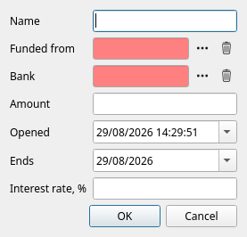
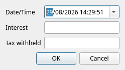

[← Investments](06-investments.md) | [Contents](README.md) | [Next: Crypto-currency →](08-crypto.md)

# 7. Term deposits

A **term deposit** is money you hand to a bank for a fixed period in exchange for interest. It is
still your money, but it is not money you can spend today — so JAL keeps each deposit as an account
of its own, of a special type, and gives it a window where everything about it is done in one place.

Everything here is optional. If you have no deposits, skip the chapter.

## The deposits window

**Reports → Deposits**:

The upper table lists every deposit that was open on the date in the top left corner: its name, the
bank, the currency, when it was opened and when it ends, the rate, the balance and the interest it
has earned so far. Select one and the lower table shows everything that has happened to it.

The five buttons along the top are the five things a deposit can do.

## Opening a deposit

**New…** asks for everything at once:

| Field | Meaning |
|---|---|
| **Name** | What you will call it. Must not clash with an existing account. |
| **Funded from** | The account the money comes out of. The deposit takes that account's currency. |
| **Bank** | The peer that holds it. Left empty, the funding account's bank is used. |
| **Amount** | How much goes in. |
| **Opened** | When it was opened. |
| **Ends** | The maturity date. |
| **Interest rate, %** | The nominal annual rate, for reference. |

**OK** creates the deposit and records the transfer that funds it. From then on the money shows in
the balances panel under *Term deposit* and no longer under your bank account.

> The rate is stored as information. JAL does **not** calculate interest for you — banks compute it
> in ways that no program can guess. You record the interest when the bank actually pays it.

## Adding to it, and taking money out

* **Put…** — move more money in from one of your accounts.
* **Get…** — take some money out, back to one of your accounts.

Both ask for the account, the date and the amount, and both record an ordinary transfer. The account
must hold the same currency as the deposit.

## Recording interest

When the bank credits interest, press **Interest…**:

Enter the date, the **Interest** the bank credited and the **Tax withheld** from it, if any. JAL
writes one operation with two lines — interest into the built-in *Interest* category, tax into
*Taxes* — so the deposit's balance rises by exactly what reached it, and both figures appear in your
income reports.

## Closing it

**Close…** offers to return the whole balance to an account of your choosing. The amount is filled in
with what JAL believes the deposit holds — correct it if the bank paid a last piece of interest you
have not recorded yet (better still: record that interest first, then close).

Closing moves the money back and deactivates the deposit. Its history stays; it simply stops
appearing in the balances panel and in the deposits list.

## Where deposits appear elsewhere

* **Balances panel** — under the *Term deposit* group, included in your total.
* **Income & spending report** — the interest under *Profits → Interest*, the withheld tax under
  *Spending → Taxes*.
* **Account balance history** — like any other account.

---

[← Investments](06-investments.md) | [Contents](README.md) | [Next: Crypto-currency →](08-crypto.md)
