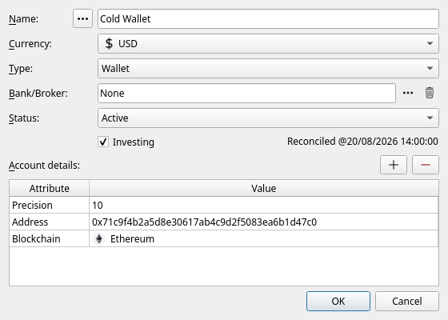
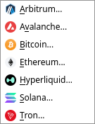
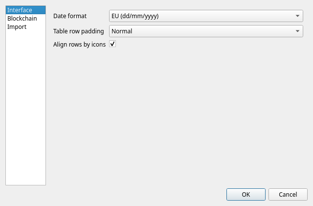
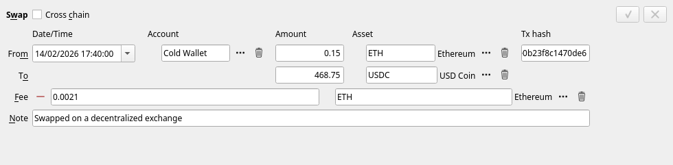
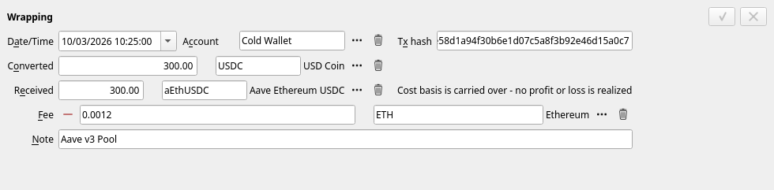
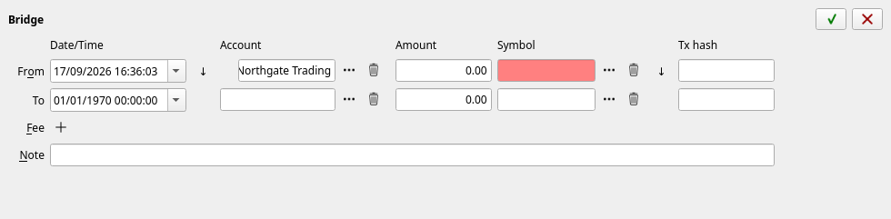
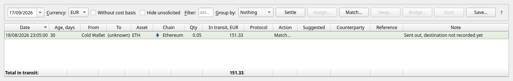

[← Term deposits](07-deposits.md) | [Contents](README.md) | [Next: Importing →](09-importing.md)

# 8. Crypto-currency

> **This chapter is for people who already hold crypto.** It assumes you know what a wallet address,
> a token and a transaction hash are. If you do not, nothing here is needed — skip to
> [chapter 9](09-importing.md).

JAL treats a coin exactly as it treats a share: something you own a quantity of, that has a price and
a cost. What is different is where the records come from — JAL can read a public blockchain directly
— and that crypto has ways of turning one asset into another that shares do not.

## Two kinds of crypto account

| Account type | Use it for | Needs |
|---|---|---|
| **Wallet** | An address on a blockchain that you control | a **Blockchain** and an **Address** attribute |
| **Crypto exchange** | Coins held for you by an exchange | nothing special |

Create either in **Data → Accounts** as usual. For a wallet, add the two attributes under *Account
details*: **Blockchain** (Ethereum, Arbitrum, Bitcoin, Solana, Tron, Hyperliquid, Avalanche, NEAR,
Cardano, Polkadot) and **Address** — the address exactly as the chain shows it. JAL refuses to create
a wallet without both, and — on the chains it knows how to check — verifies that the address really
belongs to that chain, so a typo cannot silently produce a wallet that fetches nothing.

> A Bitcoin wallet may hold an **extended public key** (`xpub…`) instead of a single address; JAL
> then follows every address the key generates. An extended public key cannot spend anything, but it
> does reveal your entire wallet history to anyone who has it — keep your database to yourself.

The wallet's currency should be the coin's usual quote currency (USD for most). One account per
address per chain.

NEAR, Cardano and Polkadot wallets are kept by hand: JAL knows these chains — the account, the price
of its coin and its logo all work — but has no reader for them, so their operations are entered
manually. Put the transaction hash into the operation's *Number* field: a reader written for the chain one
day will then recognize what you have already entered instead of importing it a second time.

## Reading a wallet from the blockchain

**Import → Blockchain → …** and pick the chain:

If you have more than one wallet on that chain, JAL asks which of them to read. It then downloads
everything that has happened at those addresses since the last time you asked, and turns it into
operations: transfers in and out, swaps, gas fees, staking rewards. Each wallet remembers how far it
was read, so the next fetch continues from there instead of starting over.

### API keys

The public explorers that serve this data ask for a free key. Without one, most of them refuse
almost every request. Put your keys in **Settings → Preferences → Blockchain**:

| Key | Needed for | Where to get it |
|---|---|---|
| **Etherscan API key** | Ethereum and Arbitrum | etherscan.io |
| **Routescan API key** | Avalanche C-chain | routescan.io |
| **Helius API key** | Solana | helius.dev |
| **TronGrid API key** | Tron | trongrid.io |

Bitcoin and Hyperliquid need no key.

### Token lists and unwanted tokens

Anyone can send anything to your address, and scam tokens with copied names are common. JAL defends
against that in two ways:

* **Import → Download token lists** fetches the public lists of tokens that are known to be genuine
  (Uniswap, CoinGecko, Jupiter and others). A token that is on such a list is imported normally.
* Everything else is judged. An arrival worth less than the **Dust airdrop threshold**
  (*Preferences → Blockchain*, in your account currency) from an address you have never dealt with
  is treated as an unsolicited airdrop and is not imported at all.

Tokens that were refused are listed in **Data → Token blacklist**, with the chain, the address and
whether JAL blacklisted it by itself. Delete a row there and the next fetch will import that token
after all.

## The three crypto operations

Beside the ordinary Buy/Sell and Transfer, crypto needs three more. Which of them fits depends on
one question: **did the value change hands, and did it stay on one account?**

### Swap — one asset exchanged for another

You gave up X of one asset and received Y of another, at whatever rate the market gave you: ETH for
USDC on a decentralised exchange. It is a sale and a purchase in one, and it **realises a profit or a
loss** on what you gave up, exactly as selling for cash would.

Tick **Include fee** to record the gas or the venue's cut. Tick **Cross chain** when what you
received arrived on a *different* account (a different chain) and possibly minutes later — the lower
line then gets its own date and account.

### Conversion — one asset becoming another, at no gain

Sometimes an asset merely changes form: wrapping ETH into WETH, depositing into a lending protocol
and getting a receipt token, staking a coin for its liquid-staking equivalent. Nothing has been
realised — you own the same value in a different wrapper — so JAL carries the **cost basis** across
and books no profit. The editor says so on its own face.

Choosing *Conversion* where a *Swap* belongs (or the other way round) is the one modelling mistake
here that matters, because it decides whether a taxable profit exists.

### Bridge — the same asset, another chain

USDC leaving Ethereum and arriving on Arbitrum is still USDC. A bridge records the departure and the
arrival as two ends of one movement, with the cost carried across and no profit realised.

The two ends are often fetched at different times, from different chains. JAL therefore accepts a
**half bridge** — the departure alone — and shows the other end as pending. When the arrival turns
up, right-click the operation and choose **Match cross-chain legs…**; JAL looks for the matching leg
itself (asking the bridging service that routed it, where it can) and offers what it found.

## Transfers with one end missing

The same applies to plain transfers: a fetch sees coins leaving your wallet and cannot know where
they went. Such half-transfers are collected in **Reports → Unsettled transfers**:

Right-click a row (or use the buttons) and tell JAL what it really was:

* **Assign an account…** — the other end is an account of yours;
* **Assign a staked position…** — the coins went into staking (see below);
* **Match with another leg…** — pair it with the opposite leg already recorded;
* **Convert into a swap…** / **Convert into a bridge…** — it was really one of those;
* **Write off as dust…** — an unsolicited crumb not worth recording.

Working this list down to empty is the routine after a fetch. Until you do, JAL knows the coins left
but not what they became.

## Staking

Coins that are staked have left your wallet but are still yours. JAL keeps them in a **staked
position** — an account of a hidden type that holds the asset on the wallet's behalf, the same idea
as a term deposit box.

You create one by settling the transfer that staked the coins: find that leg in *Unsettled
transfers*, right-click, **Assign a staked position…**, and name the position (the validator, the
protocol, the venue). Unstaking is settled the same way, in the opposite direction.

**Reports → Staked positions** then lists what is staked where, what it is worth, and — for the
venues whose balances JAL can read on chain — how much the position has **accrued** but not yet paid
out. Rewards that *were* paid out arrive in your wallet and are recorded there as an *Asset Payment*
of type **Staking reward**.

## Crypto prices

Crypto prices come from DeFiLlama and need no key. They are downloaded with everything else through
**Import → Download quotes…**; tick the chains and *Crypto exchange* among the sources.

A coin that lives on no chain JAL supports (or that you hold on an exchange) is priced through its
**CoinGecko id**, which you put in the asset's attributes — see [chapter 6](06-investments.md).

## Payment types you will meet

Blockchain imports create *Asset Payment* operations of kinds an ordinary investor never sees:

| Type | What it is |
|---|---|
| **Gas fee** | Coins burned by a transaction that moved nothing — an approval, a failed call |
| **Staking reward** | Coins earned by staking or lending |
| **Reward** | Coins received for something else — a referral, a rebate, a bonus |
| **Dust attack** | An unsolicited crumb, recorded so the balance still matches the chain |
| **Rebase adjustment** | Quantity a rebasing token gained with no transaction behind it |
| **Token account rent / rent returned** | Solana's deposit for holding a token, and its return |

You will rarely create these by hand; the fetchers do it.

---

[← Term deposits](07-deposits.md) | [Contents](README.md) | [Next: Importing →](09-importing.md)
