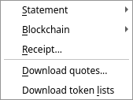
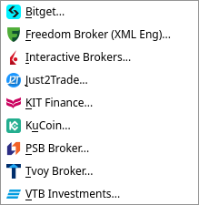
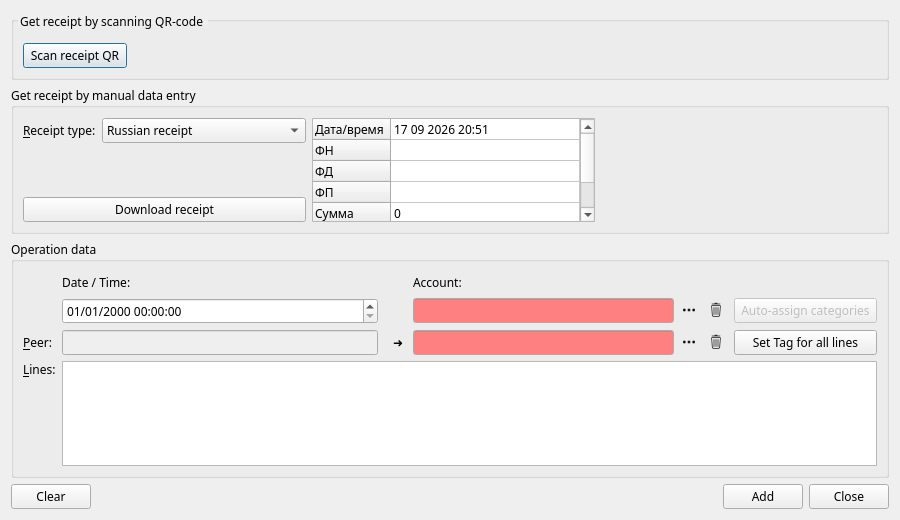

[← Crypto-currency](08-crypto.md) | [Contents](README.md) | [Next: Reports →](10-reports.md)

# 9. Importing

Typing every trade by hand is tedious and error-prone. Where your broker, your bank or a public
blockchain can hand you the data, JAL will read it.



## Broker statements

**Import → Statement → …** and choose your broker:



| Broker | File to ask them for |
|---|---|
| **Interactive Brokers** | a *Flex Query* result, `.xml` |
| **Freedom Broker** | statement in XML (English), `.xml` |
| **Just2Trade** | `.xlsx` |
| **KIT Finance** | `.xlsx` |
| **PSB Broker** | `.xlsx` or `.xls` |
| **Trading 212** | *History* export, `.csv` |
| **Tvoy Broker** | `.zip` |
| **VTB Investments** | `.xlsx` |
| **KuCoin** (crypto exchange) | export archive, `.zip` |
| **Bitget** (crypto exchange) | export archive, `.zip` |

Pick one or more files and JAL does the rest. For Interactive Brokers, set the Flex Query up once at
the broker's site to include trades, cash transactions, corporate actions and open positions; after
that, exporting is a click.

### Trading 212

Two things about this broker are unlike the rest.

**The file names no account.** A Trading 212 export has no account number anywhere — not in the data,
not in the file name — so JAL cannot work out which of your accounts it belongs to. Say it once in
**Settings → Preferences → Import**, in *Trading 212 account*; the import refuses to run until you do,
and stops if the account you named is in another currency than the statement.

**Card purchases are reviewed before they are imported.** The account has a card on it, and a purchase
you typed in yourself is already in JAL by the time the monthly export exists. Nothing identifies a
purchase on both sides — the operation has no reference number, and the two clocks rarely agree to the
minute — so JAL pairs them by the amount, ranks the candidates by how close in time they are, and shows
you the result: one row per card purchase the statement holds. The ones JAL found in the database are
unticked and say which operation they matched; the ones it did not are ticked and wait for you to give
them a **peer** and a **category**. Untick a row to leave it out, tick one to bring it in. Trades, dividends, interest and cashback do not
go through this step; they are imported straight away.

One consequence to keep in mind: interest and cashback are recorded one operation per statement row,
and JAL cannot recognise them on a second import. Import each period once.

### What an import actually does

1. **Reads** the file and checks it is what it claims to be.
2. **Matches** everything it mentions against what you already have — currencies, then assets (by
   ISIN, registration number or CUSIP first, by ticker only as a last resort), then accounts (by
   number and currency). Whatever is missing is created.
3. **Writes** the operations, inside one database transaction: either the whole statement lands, or
   nothing does.
4. **Rebuilds** the ledger and compares the statement's closing balance with its own figure.

That last step is worth understanding. If the two agree, JAL **reconciles the account automatically**
up to the statement's end date — the balance stops being coloured in the balances panel, and you know
your records match the broker's to the cent. If they disagree, the log says so:

```
Statement ending balance doesn't match: Northgate Trading / USD / 1901.30 (act) <> 1903.75 (exp)
```

and the account stays unreconciled. Something is missing or duplicated — the log above the message
usually says what.

### Importing the same statement twice

It is safe. Every operation carries the fields that identify it, and one that is already in the
database is skipped with a note in the log. Overlapping statements — say monthly ones that each
include the last day of the month before — will not double anything.

That is also why you should not "fix" an imported operation by re-importing after editing it by hand:
change it and JAL may no longer recognise it as the same operation.

### When an import fails

The log names the reason, and JAL leaves the database untouched. The usual causes are a file from a
different broker, a statement in a format the broker has changed since, or an incomplete export. If
the format has changed, please report it — see [chapter 13](13-troubleshooting.md).

## Blockchain wallets

**Import → Blockchain → …** reads a wallet directly from the chain. It needs an account of type
*Wallet* with its address, and for most chains a free API key. All of it is in
[chapter 8](08-crypto.md).

## Shop receipts *(experimental)*

**Import → Receipt…** turns a shopping receipt into an *Income / Spending* operation with one line
per item bought:



Receipts can be fetched from three services: the Russian tax service (FNS), Lidl Plus, and Pingo
Doce. Either scan the receipt's QR code with your camera or type the numbers from the receipt in by
hand, then press **Download receipt**; the lines appear at the bottom, where you choose the account
and the peer and press **Add**.

If the optional *TensorFlow* package is installed, **Auto-assign categories** guesses a category for
each item from the ones you have used before. It is a convenience and it is often wrong; check the
lines before saving.

This feature depends on services that change without notice, and it is not needed for anything else
in JAL.

## Prices and exchange rates

**Import → Download quotes…** — described in [chapter 6](06-investments.md#prices).

## Token lists

**Import → Download token lists** refreshes the public lists of known-genuine blockchain tokens, so
that fetched wallets can tell a real token from an impostor. See [chapter 8](08-crypto.md).

## Getting data out

JAL has no single "export everything" command, but:

* every report has a **Save…** button that writes it to an Excel `.xlsx` file
  ([chapter 10](10-reports.md));
* tax reports produce Excel files and, where supported, the tax authority's own format
  ([chapter 11](11-taxes.md));
* the whole database is one file you can copy — [chapter 12](12-settings-and-maintenance.md).

---

[← Crypto-currency](08-crypto.md) | [Contents](README.md) | [Next: Reports →](10-reports.md)
