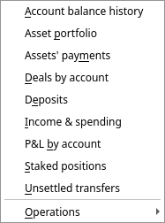
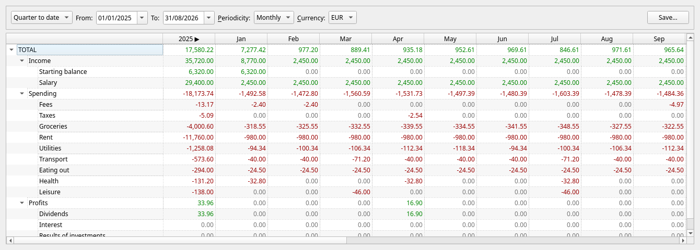
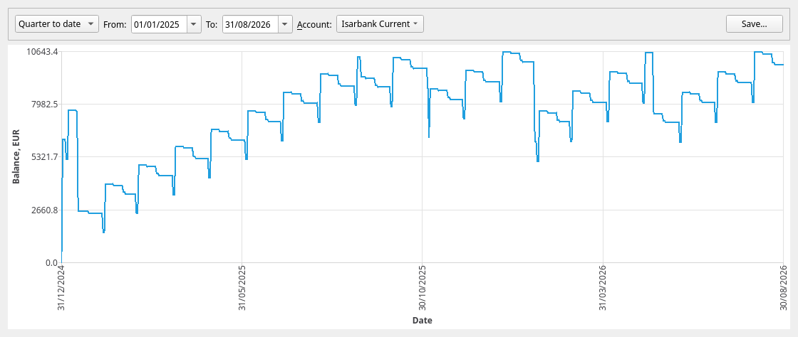
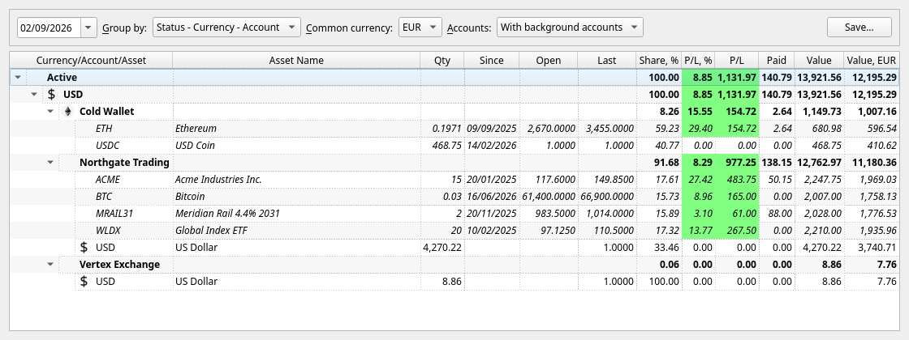
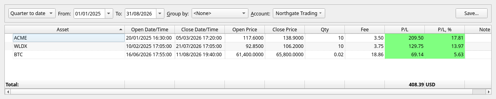
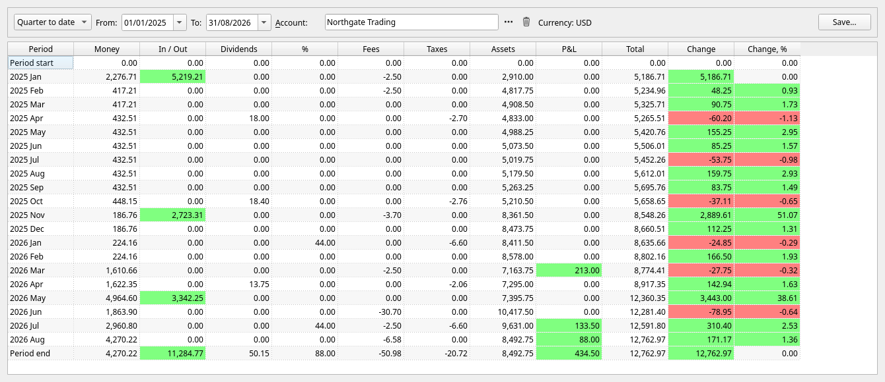
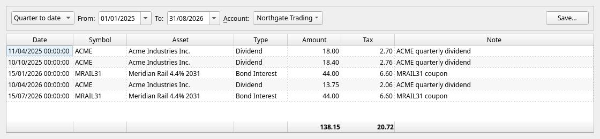
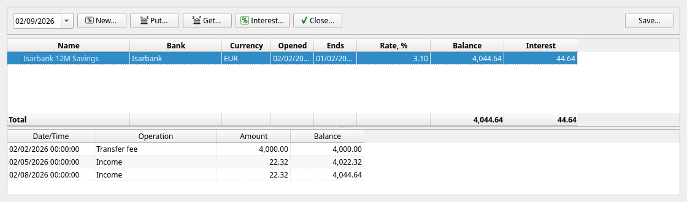
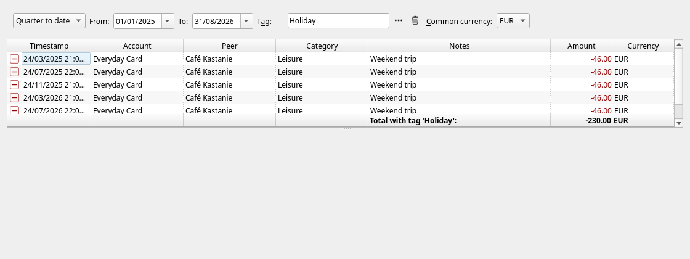
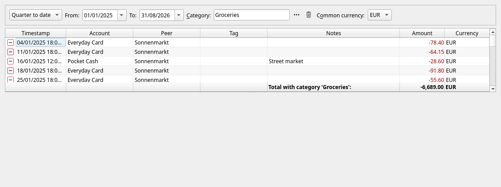

[← Importing](09-importing.md) | [Contents](README.md) | [Next: Tax reports →](11-taxes.md)

# 10. Reports

Everything JAL knows can be looked at from the **Reports** menu. Each report opens as a tab, and each
has a **Save…** button that writes what you are looking at to an Excel file.

Most reports share the same two controls:

* a **period** — a preset (*Quarter to date*, *Year to date*, *This year*, *Previous year*) plus
  **From** and **To** dates you can set yourself;
* a **currency** — everything is converted into it for the totals.

---

## Income & spending

*The one to look at first.* What came in and what went out, by category, month by month.

* Rows are your category tree; parents show the sum of everything under them.
* Columns are periods — **Periodicity** switches between monthly and weekly columns; years are
  summed into a column of their own.
* The first column is the total for the whole span.
* Green is money in, red is money out.

Right-click any figure and choose **Show operations** to see the payments behind it.

## Account balance history

How much one account held, day by day:

Pick the account and the period. Useful for spotting the month a balance started sliding, and for
seeing how regular your income really is.

## Asset portfolio

What you own, on a chosen date:

| Column | Meaning |
|---|---|
| **Qty** | How many units you hold |
| **Since** | When the oldest lot you still hold was bought |
| **Open** | The average price you paid for what you still hold |
| **Last** | The most recent price JAL has |
| **Share, %** | The position's weight in the total |
| **P/L, %** and **P/L** | Unrealised profit — what you would gain if you sold at *Last* |
| **Paid** | What the position has already paid you: dividends, coupons, rewards |
| **Value** | Quantity × *Last*, in the account's currency |
| **Value, …** | The same, converted into the common currency |

**Group by** rearranges everything — by currency and account, by asset, by country, by the tag on
the asset, by the tag on the account it is held in, or by the
[status](03-first-steps.md#step-2--create-your-accounts) of that account.
**Accounts** says how deep the report reaches: *Active accounts only*, *With background accounts*
(the default) or *With closed accounts*. Grouped by status, the background positions come as one
folded group with its own total — open it to see what is inside.

Right-click a position for its [price chart](06-investments.md#looking-at-prices), a
[tax estimate](06-investments.md#what-a-sale-would-cost-in-tax), or to give the asset a tag.

> A position with no recent price is valued at the last price JAL has, however old. If a figure looks
> stale, download quotes ([chapter 9](09-importing.md)).

## Deals by account

Every position you have **closed**, with the profit it produced:

One line per closed deal: when it was opened and closed, at what prices, the quantity, the fees, and
the profit in money and per cent. **Group by** can group them by asset, by the date they were opened
or closed, or by combinations of those. The **Total** at the bottom is the realised profit for the
period — the figure most tax authorities are interested in.

## P&L by account

What one investment account did, month by month:

| Column | Meaning |
|---|---|
| **Money** | Cash on the account at the end of the month |
| **In / Out** | Money you paid in or took out |
| **Dividends**, **%** | Dividends and interest received |
| **Fees**, **Taxes** | What was charged |
| **Assets** | Value of the holdings at the end of the month |
| **P&L** | Profit realised by deals closed that month |
| **Total** | Money + assets — what the account is worth |
| **Change**, **Change, %** | How the total moved, and how much of that you did not deposit |

The last two columns are the honest answer to *"is this account making money?"* — money you paid in
is not growth, and this report separates the two.

## Assets' payments

Every dividend, coupon and reward an account has received:

Date, asset, kind of payment, amount, tax withheld and the note. The totals at the bottom are what
the account earned in payments over the period, and what was withheld from it.

## Deposits

Term deposits — described in full in [chapter 7](07-deposits.md). Right-click a deposit to rename it
or to give it a picture.

## Staked positions

What you have staked, where, what it is worth, and what it has accrued but not yet paid out —
including the [rewards that wait at a distributor](08-crypto.md#rewards-waiting-to-be-claimed) until
you claim them. Right-click a position to rename it or to chart what it has accrued. See
[chapter 8](08-crypto.md#staking).

## Unsettled transfers

Movements that know only one of their ends — mostly from blockchain fetches and statement imports:

Each row is money or an asset "in transit". The buttons and the right-click menu let you say what it
really was: an account of yours, a staked position, the other leg of a movement already recorded, a
swap, a bridge, or dust to be written off. See [chapter 8](08-crypto.md#transfers-with-one-end-missing).

Keeping this list empty is what keeps your balances honest.

## Operations by category, peer or tag

Under **Reports → Operations** there are three reports with the same shape: pick a category, a peer
or a tag, and see every operation that carries it.

The example above answers *"what did that holiday cost me?"* — five operations under different
categories, brought together by their tag, totalled in one currency.

The *by category* one is also what opens when you right-click a figure in the *Income & spending*
report and choose **Show operations** — that is how you get from a total to the payments that made it.

## Saving a report

**Save…** writes the report to an `.xlsx` spreadsheet, exactly as it is shown — same rows, same
columns, same grouping. A report that is a chart is saved as a `.png` picture instead.

---

[← Importing](09-importing.md) | [Contents](README.md) | [Next: Tax reports →](11-taxes.md)
