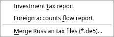
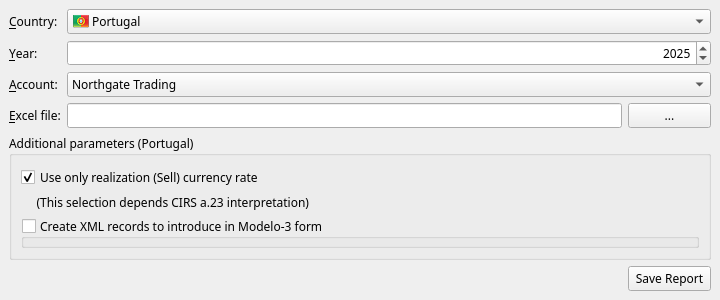
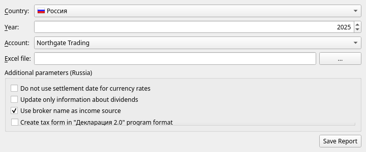
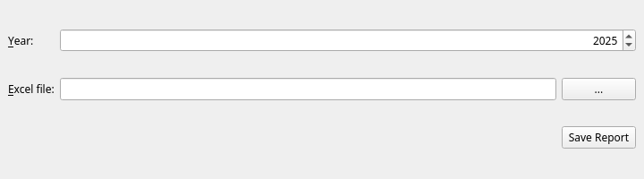

[← Reports](10-reports.md) | [Contents](README.md) | [Next: Settings and maintenance →](12-settings-and-maintenance.md)

# 11. Tax reports

> **JAL is not a tax adviser and neither is this manual.** What follows describes the buttons and the
> files they produce. Whether the figures are the ones your tax office wants, and how they should be
> declared, is between you and the rules of your country — check the result before you file it.

JAL can prepare investment tax figures for **Portugal** and **Russia**, from the operations on one
investment account for one calendar year.

## What it produces

**Tax → Investment tax report**:

| Field | What to set |
|---|---|
| **Country** | Portugal or Russia |
| **Year** | The tax year. Defaults to last year, which is usually the one being declared. |
| **Account** | The investment account. Only accounts with operations in that year are offered. |
| **Excel file** | Where to write the detailed report. |

Press **Save Report** and JAL writes a spreadsheet with one sheet per kind of income — trades,
dividends, coupons, corporate actions, fees — each line showing the amounts in the account's currency,
the exchange rate used, and the amount in the tax currency. It is meant to be readable: an inspector
(or you, next year) can follow every figure back to the operation it came from.

### The country options

**Portugal**

* **Use only realization (Sell) currency rate** — value the whole deal at the exchange rate of the
  sale, rather than converting purchase and sale each at its own rate. Which is right depends on how
  article 23 of the CIRS is read; JAL offers both and takes no side.
* **Create XML records to introduce in Modelo-3 form** — also write an XML file that can be loaded
  into the Modelo 3 declaration.

**Russia**

* **Do not use settlement date for currency rates** — take rates from the trade date instead of the
  settlement date.
* **Update only information about dividends** — fill in the dividend sections of the declaration only.
* **Use broker name as income source** — name the broker, rather than the issuer, as the source of
  income.
* **Create tax form in "Декларация 2.0" program format** — also write a declaration file for the
  official program (its extension carries the year: `.de5` for 2025, `.de6` for 2026).

## Money flow report *(Russia)*

**Tax → Foreign accounts flow report** produces the report on movements of money through a foreign
account that Russian residents must file:

Choose the year, choose where to save the spreadsheet, press **Save Report**.

## Merging declaration files

**Tax → Merge Russian tax files (\*.de5)** joins several `.de5` declaration files into one — for when
different sources of income were prepared separately and have to be filed together. Add the files
with **+**, name the output file, press OK.

## Before you file anything

* **Download prices and rates for the whole year first.** Every conversion uses a rate JAL has
  stored; a missing rate is a wrong figure. See [chapter 9](09-importing.md).
* **Check that the account reconciles.** If JAL's closing balance matches your broker's, the
  underlying data is probably complete.
* **Check the corporate actions.** JAL refuses to build the ledger past a corporate action whose
  cost shares do not add up to 100 %, and a wrong split of cost quietly produces a wrong profit —
  see [chapter 6](06-investments.md#corporate-actions).
* **Read the log** after producing the report.

For Interactive Brokers there is a detailed, step-by-step example (in Russian) of preparing a Russian
declaration, in the project repository:
[docs/ru-tax-3ndfl/taxes.md](https://github.com/titov-vv/jal/blob/master/docs/ru-tax-3ndfl/taxes.md).

---

[← Reports](10-reports.md) | [Contents](README.md) | [Next: Settings and maintenance →](12-settings-and-maintenance.md)
