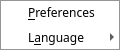
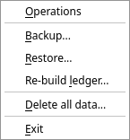
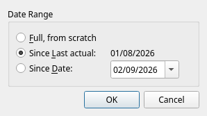

[← Tax reports](11-taxes.md) | [Contents](README.md) | [Next: When something looks wrong →](13-troubleshooting.md)

# 12. Settings and maintenance

## Preferences

**Settings → Preferences** — a small dialog with three pages:

### Interface

| Setting | What it does |
|---|---|
| **Date format** | How every date in the program is written: EU `dd/mm/yyyy`, EU short, US `mm/dd/yyyy`, US short, or ISO `yyyy-mm-dd`. |
| **Table row padding** | How much air each table row keeps around its text: *None (densest)*, *Normal*, *Roomy*. Rows always follow the font size; this is what is added on top. |
| **Align rows by icons** | Keep the space of an icon on rows that have none, so names line up. Switch it off to give that space back to the text. |

### Blockchain

API keys for the blockchain explorers, and the dust threshold — all explained in
[chapter 8](08-crypto.md#api-keys).

### Import

Which of your accounts a statement belongs to, for the exports that name no account themselves:
*Trading 212 account*, *Revolut current account* and *Revolut savings account*. Press **…** beside a
row to pick the account. Those imports refuse to run until the account they need is set —
see [chapter 9](09-importing.md#broker-statements).

Changes take effect when you press **OK**; **Cancel** discards them.

## Language

**Settings → Language** switches between English and Russian.

JAL asks whether to translate the names of the built-in categories and peers as well — answer *yes*
unless you have renamed them yourself. It then has to restart, and closes itself; start it again to
see the new language.

## Backups

Your entire ledger is one file. Losing it means typing everything again, so keep copies.

**Ledger → Backup…** asks where to save and writes a compressed `.tgz` archive containing the
database and a label with the date. It takes a second or two.

**Ledger → Restore…** reads such an archive back, replacing your current database. JAL checks that
the file really is a JAL backup before touching anything, and closes itself afterwards — restart it
to work with the restored data.

> **Restoring overwrites everything you have now.** Make a backup of the current state first, even
> if you think you do not need it.

Copying `jal.sqlite` while JAL is closed is just as good a backup. What matters is that copies exist,
somewhere other than the computer JAL runs on, and recently.

A reasonable habit: back up after every session in which you entered a lot, and always before an
upgrade or a big import.

## Re-building the ledger

The balances and reports are read from a ledger JAL maintains as you work. Occasionally it has to be
recomputed from scratch — after an upgrade that changes how something is booked, or if a figure looks
impossible.

**Ledger → Re-build ledger…**:

* **Full, from scratch** — recompute everything. Safe; on a large database it can take a while.
* **Since Last actual** — from where JAL stopped last time. This is the default and is what happens
  automatically after every edit.
* **Since Date** — from a date you choose. Use it when you know when the trouble starts.

JAL remembers which of the three you chose last and offers it again next time.

Rebuilding never changes your operations: it only recomputes what is derived from them. If a figure
is still wrong afterwards, the operations themselves are wrong.

## Deleting everything

**Ledger → Delete all data…** wipes the database and starts over. JAL asks for confirmation, then
marks the database for deletion and closes; the empty one is created the next time you start.

There is no undo. Make a backup first, even if you are sure.

## Where JAL keeps things

| What | Where |
|---|---|
| Accounts, operations, prices, settings, window layout | `jal.sqlite` — one file |
| Which folder that file is in | shown in **Help → About JAL** |
| An override for that folder | `jal.ini` in your OS configuration folder ([chapter 2](02-install.md#putting-the-file-somewhere-else)) |

Column widths, window sizes, the last folder you saved a report to — all of it lives in the database
too, so a restored backup comes back looking exactly as it did.

## Upgrading JAL

`pip install jal -U`, as in [chapter 2](02-install.md#upgrading). If the new version needs a newer
database format, JAL converts yours at the next start and may offer to rebuild the ledger — accept.

Back up first. It costs ten seconds.

---

[← Tax reports](11-taxes.md) | [Contents](README.md) | [Next: When something looks wrong →](13-troubleshooting.md)
