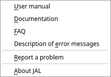

[← Settings and maintenance](12-settings-and-maintenance.md) | [Contents](README.md) | [Next: Glossary →](14-glossary.md)

# 13. When something looks wrong

## First: read the log

The **logs** button in the bottom left corner opens the panel where JAL says what it has been doing
and what it did not like. The last message is always shown on the status bar beside the button, in
grey, orange or red.

Right-click inside the panel to **Copy** its contents (useful when reporting a problem), to
**Select all**, or to **Clear** it.

## Messages you may see

The ones below are those you are most likely to meet. A terse list of every message JAL can write is
kept in [Description of error messages](../error_description.md).

### “There are no quote/rate for ACME (EUR) 12/05/2026”

JAL needed a price, or an exchange rate, for that asset on that day and has none. Whatever depended
on it is shown as zero or valued at an older price.

**Fix:** *Import → Download quotes…* for a period covering that date. If the asset is one JAL cannot
download (an unlisted fund, a private holding), add the price by hand in *Data → Quote history*.

### “Statement ending balance doesn't match: … 1901.30 (act) <> 1903.75 (exp)”

An imported statement's closing balance differs from JAL's own figure for that account. Something in
your records is missing, duplicated or wrong — often an operation entered by hand that the statement
also contains, in a slightly different form.

**Fix:** compare the account's operations with the statement around the dates involved. Until they
agree, the account stays unreconciled.

### “Operation already present in db and was skipped”

Not a problem: you imported something that was already there, and JAL declined to duplicate it. Usual
when statements overlap.

### “No account is set for … import — choose one in Settings, Preferences, Import”

A Trading 212 or Revolut export names no account, so JAL has to be told which of yours it is about.

**Fix:** **Settings → Preferences → Import** and pick the account — see
[chapter 9](09-importing.md#broker-statements). The account has to be in the same currency as the
statement, or the import stops saying so.

### “Statement balance doesn't match its own operations”

A Revolut export states a running balance on every row, and JAL checks each step against the amount
and the fee of that row. When they disagree the file is not what JAL takes it for, so nothing is
imported.

**Fix:** export the period again, unedited. If a fresh export fails the same way, report it — see
[*Reporting a problem*](#reporting-a-problem) below.

### “Results value of corporate action doesn't match 100 % of initial asset value. Date: …”

A split, merger or spin-off does not say where all of the original cost went. JAL cannot continue the
ledger past it.

**Fix:** find that corporate action in the operations list and set the **Share, %** of each resulting
asset so that they total 100. For a US spin-off, the company publishes the split in a *Form 8937*.

### “Asset amount is not enough …” / “Open position was expected but not found”

An operation disposes of more of something than the account is recorded as holding — a sale before
its purchase, a transfer of shares that never arrived, an import missing its first half.

**Fix:** look at that account and asset around the date in the message, and add what is missing (the
opening purchase, the incoming transfer). The ledger stops at this operation until you do, so
balances after it are not to be trusted.

### “Ledger is incomplete, it stopped at …”

The summary of the above: something raised an error and everything after that moment is not computed.
Fix the operation the log complains about, then *Ledger → Re-build ledger…*.

### “Open lots don't add up to the position, check the account precision”

The account counts fewer decimals than the asset needs — typically a crypto account left at the
default of 2. **Fix:** open the account, set **Precision** in *Account details* to something adequate
(8–10 for crypto), and rebuild the ledger.

### “Database data may be inconsistent after recent update. Rebuild it now?”

Shown after an upgrade that changed how something is computed. Answer **Yes**.

### “Tax adjustment for dividend: 12.30 → 10.80”

Information only: a broker retrospectively changed the tax withheld on a dividend, and the import has
followed it.

## Things that look wrong but are not

**My balance is red.** That is the reconciliation reminder, not an error — nobody has confirmed the
account against a statement lately. See [chapter 5](05-everyday-money.md#reconciling-checking-jal-against-reality).

**A card shows more than I have.** Credit limits are added to card balances by default. Right-click
the balances panel and untick **Use credit limits**.

**The portfolio shows an old price.** JAL values what it can with the newest price it has. Download
quotes.

**Totals are in the wrong currency.** The reporting currency comes from *Data → Residence*
([chapter 3](03-first-steps.md)).

**An account has disappeared.** It is probably closed, or set to *background*. Widen **Show accounts**
in the balances right-click menu — a background account is folded into the *Background* group at the
bottom of the panel — or tick **Show closed** in *Data → Accounts*.

## Frequently asked questions

**Which systems does JAL run on?**
Anywhere Python and Qt run: Linux, Windows, macOS. Some environments are awkward — Windows on ARM
has trouble building *numpy*, one of JAL's dependencies.

**I typed `pip install jal` into Python and got a SyntaxError.**
That command belongs in a terminal, not in the Python shell. If you see `>>>`, type `exit()` first,
then run it. See [chapter 2](02-install.md).

**How do I start over with a clean database?**
*Ledger → Delete all data…*, or close JAL and delete `jal.sqlite` yourself (the path is in
*Help → About JAL*). Back it up first if there is any chance you will want it back.

**Can I use JAL on two computers?**
Yes, if only one of them uses it at a time: put the database in a synced folder
([chapter 2](02-install.md#putting-the-file-somewhere-else)), and let the sync finish before opening
JAL on the other machine. Never write from both at once.

**Can two people share one database?**
No. JAL is single-user. Two people who want separate books should use two database files (and can
switch between them with `jal.ini`).

**Does JAL send my data anywhere?**
No. It contacts price sources and blockchain explorers when you ask it to, and asks them only for
public information: a ticker's price, an address's transactions. Nothing about you is uploaded.

**Do I have to enter every coffee?**
No. Many people record only what matters to them — bank and card operations, investments — and leave
cash roughly. JAL's reports are as detailed as what you put in.

## Reporting a problem

**Help → Report a problem** opens the project's issue tracker. Please include:

* what you did and what happened;
* the version, from *Help → About JAL*;
* the relevant part of the log (right-click → *Copy*);
* for an import problem, the kind of statement and the broker — **without** your personal data in it.

You can also write to [jal@gmx.ru](mailto:jal@gmx.ru) or to the
[Telegram group](https://t.me/jal_support).

Broker statement formats change without notice, and a report from someone who has the new format is
often the only way that gets fixed.

---

[← Settings and maintenance](12-settings-and-maintenance.md) | [Contents](README.md) | [Next: Glossary →](14-glossary.md)
